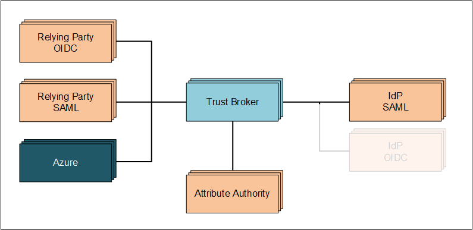

# Trust Broker Swiss

## Purpose / About
Trust Broker Swiss provides brokerage funcationality between Relying Parties (Applications, other IAM Systems or Policy Enforcement Points) and Identity Providers (IdP) and Trusted Attribute Stores. It enables Identity Providers and Relying Parties to exchange information and to trust without having any clue about each other.

If the Attribute Store contains a mapping between IDs from IdP and a central ID authority Trust Broker Swiss acts as the core of a decoupled, federated IAM system.

For more information how Trust Broker Swiss is used see the documentation of Swiss Government's IAM system [eIAM](https://www.eiam.swiss/) and [AGOV](https://www.agov.admin.ch).

For more information regarding the fundamental principles of such services please consult the [eCH standards](https://www.ech.ch/de/standard-uebersicht) around IAM.

## Main functionality
- Presenting a UI for IdP-Selection (Home Realm Discovery) to the interactive user as well as choosing a valid identity provider by applying formerly defined rules or by respecting request information provided in the federation protocol
rewriting requests to the selected IdP
- After receipt of the IdP's SAML-Response generation of a  SAML-Assertion or OIDC-Token enriched by information from the Attribute Store (for example: application-role information)
- Sending the result to the Relying Party 
- Signature of messages and verification of signed messages between IdPs and the Trust Broker Swiss and between Relying Parties and the Trust Broker Swiss
- SSO functionality with a best effort implementation of SLO or better global log out

## Configuration
The configuration is based on XML-files which are retrieved from Bitbucket at run time. Reconfig does not require a restart. If you want to know more, please consult [Configuration.md]()

## Features not published as OSS
Of course every organisation has its own processes and business rules. Some of those require solutions, which are most probably not interessting for others. Therefore these parts have been moved into a not public available module. Nonetheless we might have a solution for your problem already. Just ask and we will try to help.
